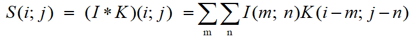
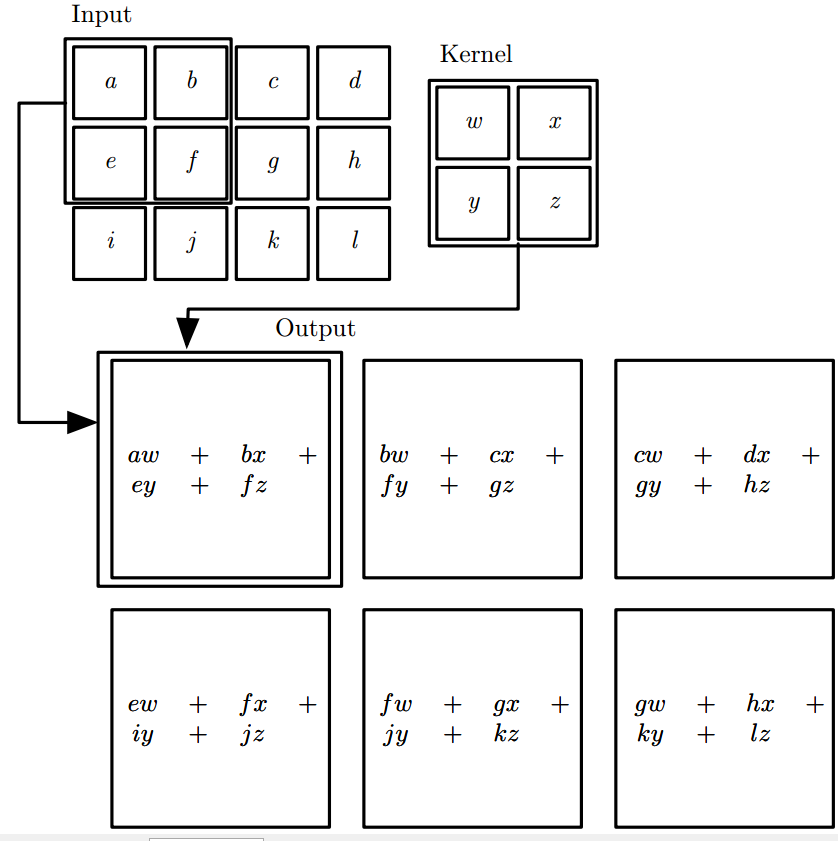

#卷积神经网络（Convolutional Neural Network, CNN）

####  

卷积神经网路（Convolutional Neural Network, CNN）是一种前馈神经网络，它的人工神经元可以响应一部分覆盖范围内的周围单元，对于大型图像处理有出色表现。 

卷积神经网路由一个或多个卷积层和顶端的全连接层组成，同时也包括关联权重和池化层。这一结构使得卷积神经网路能够利用输入数据的二维结构。与其他深度学习结构相比，卷积神经网路在图像和语音识别方面能够给出更好的结果。这一模型也可以使用反向传播算法进行训练。相比较其他深度、前馈神经网路，卷积神经网路需要考量的参数更少，使之成为一种颇具吸引力的深度学习结构。 

####
---
1.卷积层
####
卷积网络一词表明该网络使用了卷积 (convolution) 这种数学运算。卷积是一种特殊的线性运算。 卷积网络是指那些至少在网络的一层中使用卷积运算来替代一般的矩阵乘法运算的神经网络。 

在卷积神经网络的术语中，第一个参数叫做输入 (input)，输入可以是图像、语音、文本等信息。第二个参数叫做核函数 (kernel function)。输出被称作特征映射 (feature map)。

我们有时对多个维度进行卷积运算。例如，如果把二维的图像 I 作为输入，我们也相应的需要使用二维的核 K： 

下图显示了一个 2 维卷积的例子。我们用画有箭头的方框来说明输出张量的左上角元素是如何通过对输入张量相应的左上角区域使用核进行卷积得到的。

---
2.线性整流层

线性整流层（Rectified Linear Units layer, ReLU layer）使用线性整流（Rectified Linear Units, ReLU） **f(x)=max(0,x)**作为这一层神经的激励函数。它可以增强判定函数和整个神经网路的非线性特性，而本身并不会改变卷积层。

事实上，其他的一些函数也可以用于增强网路的非线性特性，如双曲正切函数**f(x)=tanh(x)，f(x)=|tanh(x)|**，或者Sigmoid函数 **f(x)=(1+e^{-x})^{-1}** 。相比其它函数来说，ReLU函数更受青睐，这是因为它可以将神经网路的训练速度提升数倍，而并不会对模型的泛化准确度造成显著影响。

---
3.池化层

池化（Pooling）是卷积神经网络中另一个重要的概念，它实际上一种形式的向下采样。有多种不同形式的非线性池化函数，而其中“最大池化（Max pooling）”是最为常见的。它是将输入的图像划分为若干个矩形区域，对每个子区域输出最大值。直觉上，这种机制能够有效地原因在于，在发现一个特征之后，它的精确位置远不及它和其他特征的相对位置的关系重要。池化层会不断地减小数据的空间大小，因此参数的数量和计算量也会下降，这在一定程度上也控制了过拟合。通常来说，CNN的卷积层之间都会周期性地插入池化层。 
池化层通常会分别作用于每个输入的特征并减小其大小。目前最常用形式的池化层是每隔2个元素从图像划分出2*2的区块，然后对每个区块中的4个数取最大值。这将会减少75%的数据量。 
除了最大池化之外，池化层也可以使用其他池化函数，例如“平均池化”甚至“L2-范数池化”等。过去，平均池化的使用曾经较为广泛，但是最近由于最大池化在实践中的表现更好，平均池化已经不太常用。 

---
4.损失函数层

损失函数层（loss layer）用于决定训练过程如何来“惩罚”网络的预测结果和真实结果之间的差异，它通常是网络的最后一层。各种不同的损失函数适用于不同类型的任务。例如，Softmax交叉熵损失函数常常被用于在K个类别中选出一个，而Sigmoid交叉熵损失函数常常用于多个独立的二分类问题。 

---
5.典型CNN
+ LeNet，这是最早用于数字识别的CNN
+ AlexNet， 2012 ILSVRC比赛远超第2名的CNN，比LeNet更深，用多层小卷积层叠加替换单大卷积层。
+ ZF Net， 2013 ILSVRC比赛冠军
+ GoogLeNet， 2014 ILSVRC比赛冠军
+ VGGNet， 2014 ILSVRC比赛中的模型，图像识别略差于GoogLeNet，但是在很多图像转化学习问题(比如object detection)上效果较好

6.应用

+ 计算机视觉：卷积神经网络已被证实在计算机视觉任务中有不错的效果，例如：图像分类、目标检测、目标分割等领域
+ 自然语言处理：CNN的模型被证明可以有效的处理各种自然语言处理的问题，如语义分析、搜索结果提取、句子建模 、分类、预测、和其他传统的NLP任务等。
+ 人工智能（围棋）：卷积神经网路在计算机围棋领域也被使用。2016年3月，AlphaGo对战李世乭的比赛，展示了深度学习在围棋领域的重大突破。

---
7.历史

卷积网络在深度学习的历史中发挥了重要作用。它们是将研究大脑获得的深刻理解成功用于机器学习应用的关键例子。它们也是第一个表现良好的深度模型之一，远远早于任意深度模型被认为是可行的。 卷积网络也是第一个解决重要商业应用的神经网络，并且仍然是当今深度学习商业应用的前沿。例如，在 20 世纪 90 年代， AT&T 的神经网络研究小组开发了一个用于读取支票的卷积网络(LeCun et al.,2001)。到 90 年代末， NEC 部署的这个系统用于读取美国所有支票的 10％以上。后来，微软部署了若干个基于卷积网络的 OCR 和手写识别系统 (Simard et al., 2003)。

卷积网络也被用来赢得许多比赛。当前对深度学习的商业兴趣的热度始于Krizhevsky et al. (2012a) 赢得了 ImageNet 对象识别挑战，卷积网络已经被用于赢得其他机器学习和计算机视觉竞赛了，这些比赛在几年前影响较小。

---
8.总结

总而言之，卷积神经网络有以下优缺点： 
优点

+ 共享卷积核，对高维数据处理无压力
+ 无需手动选取特征，训练好权重，即得特征分类效果好

缺点 

+ 需要调参，需要大样本量，训练需要GPU
+ 物理含义不明确

卷积网络在本质上是一种输入到输出的映射，它能够学习大量的输入与输出之间的映射关系，而不需要任何输入和输出之间的精确的数学表达式，只要用已知的模式对卷积网络加以训练，网络就具有输入输出对之间的映射能力。
